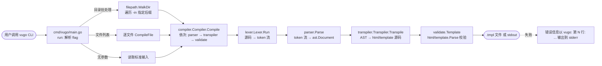
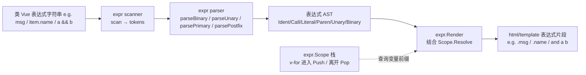
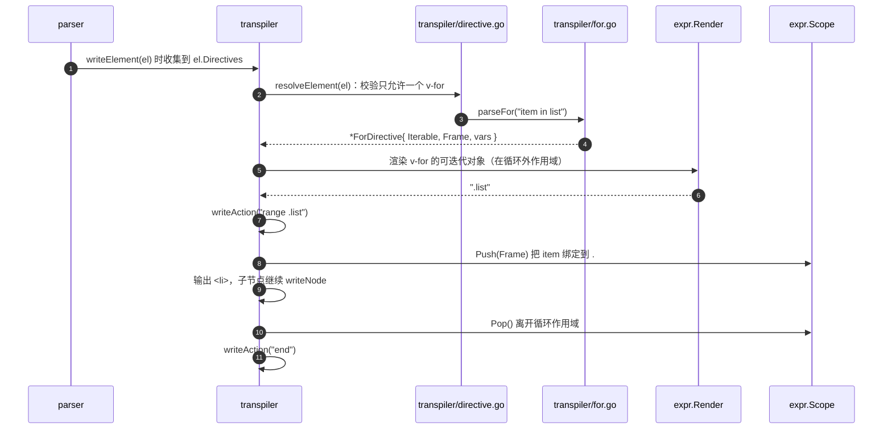
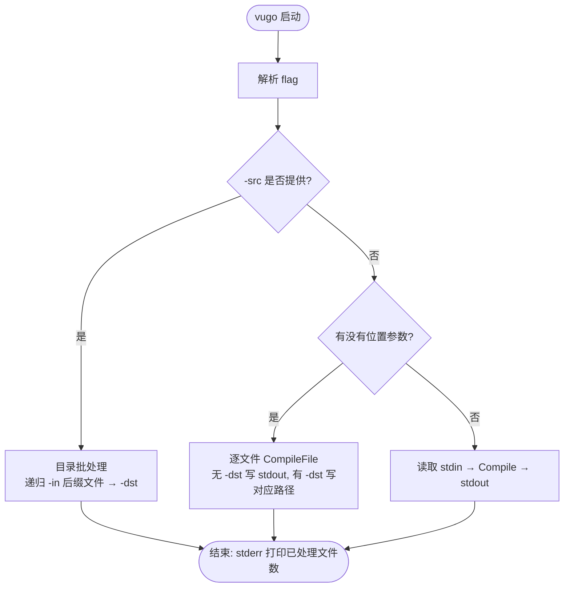

# 🦫 vugo

**让 Go 模板像 Vue 一样丝滑。**

`vugo` 是一个轻量级模板预处理器，将类 Vue 的声明式语法转译为 Go 标准库 `html/template` 语法。

> **核心目标**：提升模板可读性，同时**零运行时依赖**、**完全兼容现有生态**、**保留原生 XSS 防护**。

---

## 为什么选择 vugo？

| 特性 | 说明 |
| :--- | :--- |
| **高可读性** | 告别 `{{ range $i, $v := .List }}`，拥抱 `v-for` 和 `{{ item.name }}` |
| **原生安全** | 转译后仍走 `html/template`，自动上下文转义，无需担心 XSS |
| **生态兼容** | 输出纯 `.tmpl` 文件，无缝接入 Gin/Echo/标准库，无需改构建流程 |
| **零运行时** | 仅在构建/开发阶段转译，生产环境无额外性能开销 |
| **渐进式迁移** | 支持在现有项目中混用，老模板无需一次性重写 |

---

## 快速开始

### 1. 安装

```bash
go install github.com/quhongbin/vugo/cmd/vugo@latest
```

### 2. 编写模板

创建 `index.vugo`：

```html
<div class="user-list">
  <!-- 类 Vue 语法 -->
  <h2>Welcome, {{ user.name }}!</h2>
  <ul>
    <li v-for="item in todos">
      <span>{{ item.text }}</span>
    </li>
  </ul>
</div>
```

### 3. 转译

```bash
vugo -src ./templates -dst ./dist
```

### 4. 查看结果

生成的 `dist/index.tmpl`：

```html
<div class="user-list">
  <h2>Welcome, {{ .user.name }}!</h2>
  <ul>
    {{ range .todos }}
    <li>
      <span>{{ .text }}</span>
    </li>
    {{ end }}
  </ul>
</div>
```

> 当前版本支持的语法见下一节「语法对照表」和「已知限制」。示例采用 `v-for` + 文本插值的最小集合，保证命令可运行。

---

## 语法对照表

| Vue-like (`vugo`) | Go Standard (`html/template`) | 备注 |
| :--- | :--- | :--- |
| `{{ msg }}` | `{{ .msg }}` | 自动补全根数据点 `.` |
| `<li v-for="item in list">` | `{{ range .list }}<li>...{{ end }}` | 自动处理作用域，`item` 渲染为 `.` |
| `<li v-for="(item, i) in list">` | `{{ range $i, $item := .list }}<li>...{{ end }}` | 下标与元素顺序自动互换 |
| `{{ a === b }}` | `{{ if eq a b }}…{{ end }}` | `===` 转 `eq`，`!==` 转 `ne` |
| `{{ a && b }}` | `{{ if and a b }}…{{ end }}` | `&&` 转 `and`，`\|\|` 转 `or` |
| `{{ !flag }}` | `{{ if not .flag }}…{{ end }}` | `!` 转 `not` |
| `{{ formatTime(time) }}` | `{{ formatTime .time }}` | 自定义函数需通过 `c.Funcs` 注册 |

> 完整的转译映射、禁止行为与不支持语法见 [`AGENTS.md`](./AGENTS.md)。

---

## 项目结构

```
vugo/
├── cmd/
│   └── vugo/
│       └── main.go              # CLI 入口：解析 flag、调度 Compiler、处理目录或单文件
├── internal/
│   ├── lexer/
│   │   ├── lexer.go             # 词法分析：源码 → token 流（Text/Mustache/Comment/OpenTag/CloseTag/...）
│   │   └── lexer_test.go
│   ├── parser/
│   │   ├── parser.go            # 语法分析：token 流 → AST；区分指令/绑定/插值/原生 action
│   │   └── parser_test.go
│   ├── ast/
│   │   └── ast.go               # 模板 AST 节点：Document/Text/Interpolation/GoAction/Element/Directive/Binding
│   ├── expr/
│   │   ├── ast.go               # 表达式 AST 子语言：Ident/Call/Literal/Paren/Unary/Binary
│   │   ├── scanner.go           # 表达式词法
│   │   ├── parser.go            # 表达式语法（递归下降，含运算符优先级）
│   │   ├── scope.go             # 循环变量作用域栈（v-for 绑定）
│   │   ├── render.go            # 表达式 → html/template 源码（处理 &&→and、!→not 等）
│   │   └── expr_test.go
│   ├── transpiler/
│   │   ├── transpiler.go        # AST → html/template 源码的主体编排
│   │   ├── directive.go         # 不支持的指令/绑定的报错与替代方案
│   │   ├── for.go               # v-for 解析与展开为 {{ range }}…{{ end }}
│   │   └── transpiler_test.go
│   ├── compiler/
│   │   └── compiler.go          # 流水线编排：lexer→parser→transpiler→validate，可注入 Funcs
│   └── validate/
│       └── validate.go          # 用 html/template.Parse 校验产物
├── AGENTS.md                    # 项目规约、转译映射、注释规范
├── README.md                    # 本文件
├── Makefile                     # build / test / fmt / vet / run
├── go.mod
└── LICENSE
```

---

## 各文件作用

下表逐文件说明职责，以及它依赖谁、又会被谁调用，便于定位改动影响面。

| 文件 | 职责 | 输入 | 输出 | 上游 / 下游 |
| :--- | :--- | :--- | :--- | :--- |
| `cmd/vugo/main.go` | CLI 入口：解析 `-src/-dst/-in/-out/-funcs/-no-validate/-v`；按入参选择「目录批量 / 文件列表 / 标准输入」三种工作模式 | 命令行参数、文件或目录 | 转译后文件、`vugo: ...` 错误 | 调用 `compiler.New()`；被用户直接执行 |
| `internal/lexer/lexer.go` | 把源码切成 token 序列，识别 `{{ }}` `<!-- -->`、开始/自闭合/结束标签；处理属性中的引号、`<!DOCTYPE>` 等声明 | 模板源码字符串 | `[]lexer.Token` | 被 `parser.ParseString` 调用 |
| `internal/parser/parser.go` | 维护开标签栈还原嵌套结构，把 token 流构造成 `ast.Document`；解析属性为 `Attr/Directive/Binding`；区分类 Vue 与原生 `html/template` action | `[]lexer.Token` | `*ast.Document` | 被 `compiler.Compile` / `parser.ParseString` 调用 |
| `internal/ast/ast.go` | 模板 AST 节点定义：`Document/Text/Interpolation/GoAction/Element(含 Void 判断)/Directive/Binding`；提供 `Node` 公共接口 | — | — | 被 `parser` 生产、`transpiler` 消费 |
| `internal/expr/scanner.go` | 表达式子语言的词法器：识别标识符、数字、字符串、标点和运算符（含 `===` `!==` 等） | 表达式字符串 | `[]expr.token` | 被 `expr.Parse` 调用 |
| `internal/expr/parser.go` | 表达式语法分析：递归下降，按运算符优先级构造 `Ident/Call/Literal/Paren/Unary/Binary`；一元 `-` 仅支持数字字面量 | `[]expr.token` | `Expr` | 被 `expr.Parse` 调用 |
| `internal/expr/scope.go` | 循环变量作用域栈：进入 `v-for` 时 `Push` 一帧，离开时 `Pop`；`Resolve` 自内向外查找变量名对应的模板前缀 | 标识符名 | 前缀（`$var` 或 `.`）与是否命中 | 被 `transpiler` 与 `expr.Render` 调用 |
| `internal/expr/render.go` | 把表达式 AST 生成为 `html/template` 表达式源码：`msg`→`.msg`、`item`→`.`、`a && b`→`and a b`、`!a`→`not a`，字符串字面量统一输出双引号 | `Expr`, `*Scope` | 渲染好的表达式片段 | 被 `transpiler` 调用 |
| `internal/expr/ast.go` | 表达式 AST 节点定义与公共 `Expr` 接口 | — | — | 被 `expr` 内 parser/render 共享 |
| `internal/transpiler/transpiler.go` | 遍历 AST 输出源码，遇到 `Interpolation` 调 `expr.Render`；遇到 `Element` 调 `resolveElement` 与 `writeElement`；维护 `scope` | `*ast.Document` | html/template 源码 | 被 `compiler.Compile` 调用 |
| `internal/transpiler/for.go` | 解析 `v-for` 表达式 `item in list` / `(item, index) in list`，返回 `*ForDirective`；生成 `range` 头并把循环变量压栈 | 指令值字符串 | `*ForDirective` | 被 `transpiler.writeElement` 调用 |
| `internal/transpiler/directive.go` | 检查元素指令/绑定是否支持，对 `v-if/v-model/v-slot/v-html/...` 等给出明确的「暂未实现 + 替代方案」错误 | `*ast.Element` | `error` | 被 `transpiler.resolveElement` 调用 |
| `internal/compiler/compiler.go` | 流水线编排：parser → transpiler → validate；暴露 `Compile`/`CompileFile`/`Transpile`，可注入 `Funcs` 用于校验 | 源码或文件路径 | 转译后字符串 | 被 `cmd/vugo` 调用 |
| `internal/validate/validate.go` | 用 `html/template` 的 `template.New(...).Funcs(...).Parse(...)` 校验产物 | 模板名、源码、`Funcs` | `error` | 被 `compiler.Compile` 调用 |

---

## 工作协调流程

> 以下流程图均使用 mermaid，可在 GitHub、VS Code 等支持环境直接渲染。

### 1) 端到端流水线（CLI → 产物）



### 2) 表达式子流水线（被 transpiler 调用）



### 3) `v-for` 展开时序



### 4) CLI 三种工作模式



---

## 代码规范

所有内部 API 必须遵循 [`AGENTS.md`](./AGENTS.md) 中的「代码注释规范」——每个导出函数 / 类型 / 字段都要写 godoc 注释，列出参数与返回值的语义、错误触发条件、副作用与并发语义。

- **文档同步约定**：每当新增 / 修改 / 删除文件或函数、变更对外行为时，必须同步更新本 `README.md` 中对应的「项目结构」「各文件作用」「工作协调流程」等章节，保持与代码一致。

---

## 已知限制

为了保持轻量和兼容性，以下 Vue 特性**不支持**：

1. **`v-model`**：服务端无双向绑定，请拆分为 `:value` + `@input` 事件处理。
2. **`<slot>` / `v-slot`**：请使用 `{{ define "SlotName" }}` + `{{ template "SlotName" . }}` 组合。
3. **计算属性 / 响应式数据**：请在 Go 后端计算好数据后传入模板。
4. **`v-if` / `v-else` / `v-show`**：请直接使用原生 `html/template` 的 `{{ if }}…{{ else }}…{{ end }}`。
5. **`v-html` / `v-text` / `v-pre` / `v-cloak` / `v-once`**：通常无意义或破坏安全转义，请改用 `{{ .field }}`。

---

## 贡献

欢迎提交 Issue 或 PR！

- 发现转译 Bug？请提供 `.vugo` 源码和期望输出。
- 有新语法建议？请先开 Issue 讨论。
- 修改任何 Go 文件或新增函数时，请同时更新对应的 `README.md` / `AGENTS.md`。

---

## License

[MIT License](./LICENSE)
