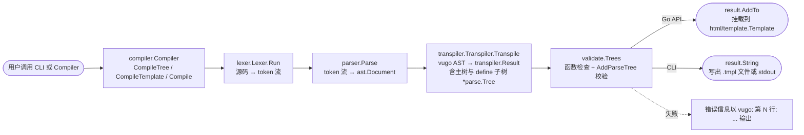
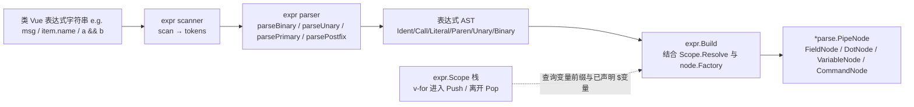
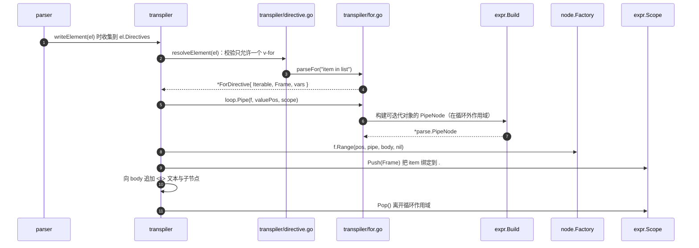

# 🦫 vugo

**让 Go 模板像 Vue 一样丝滑。**

`vugo` 是一个轻量级模板预处理器，将类 Vue 的声明式语法转译为 Go 标准库 `html/template` 语法。

> **核心目标**：提升模板可读性，同时**零运行时依赖**、**完全兼容现有生态**、**保留原生 XSS 防护**。

---

## 为什么选择 vugo？

| 特性 | 说明 |
| :--- | :--- |
| **高可读性** | 告别 `{{ range $i, $v := .List }}`，拥抱 `v-for` 和 `{{ item.name }}` |
| **原生安全** | 转译后仍走 `html/template`，自动上下文转义，无需担心 XSS |
| **生态兼容** | 输出纯 `.tmpl` 文件，无缝接入 Gin/Echo/标准库，无需改构建流程 |
| **零运行时** | 仅在构建/开发阶段转译，生产环境无额外性能开销 |
| **渐进式迁移** | 支持在现有项目中混用，老模板无需一次性重写 |

---

## 快速开始

### 1. 安装

```bash
go install github.com/quhongbin/vugo/cmd/vugo@latest
```

### 2. 编写模板

创建 `index.vugo`：

```html
<div class="user-list">
  <!-- 类 Vue 语法 -->
  <h2>Welcome, {{ user.name }}!</h2>
  <ul>
    <li v-for="item in todos">
      <span>{{ item.text }}</span>
    </li>
  </ul>
</div>
```

### 3. 转译

```bash
vugo -src ./templates -dst ./dist
```

### 4. 查看结果

生成的 `dist/index.tmpl`：

```html
<div class="user-list">
  <h2>Welcome, {{ .user.name }}!</h2>
  <ul>
    {{ range .todos }}
    <li>
      <span>{{ .text }}</span>
    </li>
    {{ end }}
  </ul>
</div>
```

> 当前版本支持的语法见下一节「语法对照表」和「已知限制」。示例采用 `v-for` + 文本插值的最小集合，保证命令可运行。

---

## 语法对照表

| Vue-like (`vugo`) | Go Standard (`html/template`) | 备注 |
| :--- | :--- | :--- |
| `{{ msg }}` | `{{ .msg }}` | 自动补全根数据点 `.` |
| `<li v-for="item in list">` | `{{ range .list }}<li>...{{ end }}` | 自动处理作用域，`item` 渲染为 `.` |
| `<li v-for="(item, i) in list">` | `{{ range $i, $item := .list }}<li>...{{ end }}` | 下标与元素顺序自动互换 |
| `{{ a === b }}` | `{{ if eq a b }}…{{ end }}` | `===` 转 `eq`，`!==` 转 `ne` |
| `{{ a && b }}` | `{{ if and a b }}…{{ end }}` | `&&` 转 `and`，`\|\|` 转 `or` |
| `{{ !flag }}` | `{{ if not .flag }}…{{ end }}` | `!` 转 `not` |
| `{{ formatTime(time) }}` | `{{ formatTime .time }}` | 自定义函数需通过 `c.Funcs` 注册 |

> 完整的转译映射、禁止行为与不支持语法见 [`AGENTS.md`](./AGENTS.md)。

---

## 项目结构

```
vugo/
├── cmd/
│   └── vugo/
│       ├── main.go              # CLI 入口：解析 flag、调度 Compiler、处理目录或单文件
│       └── main_test.go         # CLI 端到端测试：stdin / 文件 / 目录三种模式 + 错误路径
├── internal/
│   ├── lexer/
│   │   ├── lexer.go             # 词法分析：源码 → token 流（含 Pos/RawPos 字节偏移）
│   │   ├── lexer_test.go
│   │   └── doc.md
│   ├── parser/
│   │   ├── parser.go            # 语法分析：token 流 → vugo AST；区分指令/绑定/插值/原生 action
│   │   ├── parser_test.go
│   │   └── doc.md
│   ├── ast/
│   │   ├── ast.go               # 模板 AST 节点：Document/Text/Interpolation/GoAction/Element/Directive/Binding
│   │   └── doc.md
│   ├── node/
│   │   ├── factory.go           # text/template/parse 节点工厂：通过原型克隆创建带非空 tr 的标准库 AST 节点
│   │   ├── native.go            # 原生 html/template 动作与分支管道解析器
│   │   └── doc.md
│   ├── expr/
│   │   ├── ast.go               # 表达式 AST 子语言：Ident/Call/Literal/Paren/Unary/Binary
│   │   ├── scanner.go           # 表达式词法
│   │   ├── parser.go            # 表达式语法（递归下降，含运算符优先级）
│   │   ├── scope.go             # 循环变量与模板 $变量 作用域栈（v-for 与原生块绑定）
│   │   ├── build.go             # 表达式 AST → text/template/parse.PipeNode（处理 &&→and、!→not 等）
│   │   ├── expr_test.go
│   │   └── doc.md
│   ├── transpiler/
│   │   ├── transpiler.go        # vugo AST → *parse.Tree 语法树的主体编排
│   │   ├── result.go            # Result（主树 + define 子树）：提供 AddTo(tmpl) 挂载与 String() 序列化
│   │   ├── directive.go         # 不支持的指令/绑定的报错与替代方案
│   │   ├── for.go               # v-for 解析与构建为 parse.RangeNode 管道
│   │   ├── transpiler_test.go   # 黄金文件对照 + v-for 语义 + XSS 转义 + AST 边界测试
│   │   └── doc.md
│   ├── compiler/
│   │   ├── compiler.go          # 流水线编排：CompileTree/CompileTemplate/AddToTemplate/Compile/CompileFile
│   │   ├── compiler_test.go     # 公共 API 测试：AddParseTree 执行、转义报错定位、Validate 开关
│   │   └── doc.md
│   └── validate/
│       ├── validate.go          # 用 AddParseTree 与 html/template.Parse 校验语法树及自定义函数
│       └── doc.md
├── testdata/                    # 黄金文件：*.vugo 为输入，*.tmpl 为期望产物
│   ├── basic.vugo / basic.tmpl         # 插值、静态属性、注释、void 标签
│   ├── for.vugo / for.tmpl             # v-for 单变量与 (item, index) 双变量
│   ├── for-nested.vugo / for-nested.tmpl # 嵌套 v-for 的作用域语义
│   ├── expr.vugo / expr.tmpl           # 表达式映射（===/!==/&&/||/!/>/函数调用）
│   └── passthrough.vugo / passthrough.tmpl # 原生 html/template action 原样透传
├── AGENTS.md                    # 项目规约、转译映射、注释规范
├── ARCHITECTURE_FLOW.md         # 架构与功能流程详解文档
├── README.md                    # 本文件
├── Makefile                     # build / test / cover / fmt / vet / run
├── go.mod
└── LICENSE
```

---

## 各文件作用

下表逐文件说明职责，以及它依赖谁、又会被谁调用，便于定位改动影响面。

| 文件 | 职责 | 输入 | 输出 | 上游 / 下游 |
| :--- | :--- | :--- | :--- | :--- |
| `cmd/vugo/main.go` | CLI 入口：解析 `-src/-dst/-in/-out/-funcs/-no-validate/-v`；按入参选择「目录批量 / 文件列表 / 标准输入」三种工作模式 | 命令行参数、文件或目录 | 转译后文件、`vugo: ...` 错误 | 调用 `compiler.New()`；被用户直接执行 |
| `cmd/vugo/main_test.go` | CLI 端到端测试：用 `bytes.Buffer` 捕获 stdout/stderr，覆盖 stdin / 单文件 / 目录批处理三种模式、`-funcs` 与 `-no-validate` 开关、以及不支持语法的报错路径 | 命令行参数、临时目录中的 `.vugo` 文件 | 测试断言 | 被 `go test ./cmd/vugo` 调用 |
| `internal/lexer/lexer.go` | 把源码切成 token 序列（记录 `Line`/`Pos`/`RawPos`），识别 `{{ }}` `<!-- -->`、开始/自闭合/结束标签；处理属性中的引号、`<!DOCTYPE>` 等声明 | 模板源码字符串 | `[]lexer.Token` | 被 `parser.ParseString` 调用 |
| `internal/parser/parser.go` | 维护开标签栈还原嵌套结构，把 token 流构造成 `ast.Document`；解析属性为 `Attr/Directive/Binding`（属性值内含 `{{ }}` 时预拆分为 `Parts`）；区分类 Vue 与原生 `html/template` action | `[]lexer.Token` | `*ast.Document` | 被 `compiler.CompileTree` / `parser.ParseString` 调用 |
| `internal/ast/ast.go` | 模板 AST 节点定义：`Document/Text/Interpolation/GoAction/Element(含 Void 判断)/Directive/Binding`；提供 `Node` 公共接口 | — | — | 被 `parser` 生产、`transpiler` 消费 |
| `internal/node/factory.go` | `text/template/parse` 节点工厂：利用 `\x02`/`\x03` 定界符解析原型模板，克隆创建内部 `tr *parse.Tree` 指向 `.vugo` 源码树的各类标准库 AST 节点 | `.vugo` 源码、字节偏移 `pos` | `*parse.Tree` 与各类 `parse.Node` | 被 `expr.Build` 与 `transpiler` 调用 |
| `internal/node/native.go` | 原生动作解析器：结合当前可见的 `$变量` 列表，将原生 `if/range/with` 管道或单动作解析为 `parse.PipeNode` / `parse.Node` | 原生动作代码、偏移 `pos`、`vars` | `*parse.PipeNode` / `parse.Node` | 被 `transpiler.native` 调用 |
| `internal/expr/scanner.go` | 表达式子语言的词法器：识别标识符、数字、字符串、标点和运算符（含 `===` `!==` 等） | 表达式字符串 | `[]expr.token` | 被 `expr.Parse` 调用 |
| `internal/expr/parser.go` | 表达式语法分析：递归下降，按运算符优先级构造 `Ident/Call/Literal/Paren/Unary/Binary`；一元 `-` 仅支持数字字面量 | `[]expr.token` | `Expr` | 被 `expr.Parse` 调用 |
| `internal/expr/scope.go` | 循环变量与模板 `$变量` 作用域栈：进入 `v-for` 或原生块时 `Push`/`PushBlock`，离开时 `Pop`；`Resolve` 查找类 Vue 变量前缀，`HasVar`/`Vars` 跟踪已声明的 `$变量` | 标识符名 | 前缀（`$var` 或 `.`）与可见变量表 | 被 `transpiler` 与 `expr.Build` 调用 |
| `internal/expr/build.go` | 把表达式 AST 直接构建为 `*parse.PipeNode`：`msg`→`FieldNode`、`item`→`DotNode`、`a && b`→`CommandNode{and, a, b}`、`!a`→`CommandNode{not, a}` | `src`, `base`, `*Scope`, `*node.Factory` | `*parse.PipeNode` | 被 `transpiler` 调用 |
| `internal/expr/ast.go` | 表达式 AST 节点定义与公共 `Expr` 接口 | — | — | 被 `expr` 内 parser/build 共享 |
| `internal/transpiler/transpiler.go` | 遍历 vugo AST 构建 `*parse.Tree`：遇到 `Interpolation` 调 `expr.Build`；遇到 `Element` 构建 `RangeNode` 与标签文本节点；遇到 `GoAction` 组装原生控制流节点 | `*ast.Document`, `name`, `src` | `*transpiler.Result` | 被 `compiler.CompileTree` 调用 |
| `internal/transpiler/result.go` | 持有转译产出的主树 `Main` 与 `Defines` 子树；提供 `AddTo(*template.Template)` 挂载 `AddParseTree` 以及 `String()` 序列化为 `.tmpl` 源码 | `*parse.Tree` 集合 | `*template.Template` 或源码字符串 | 被 `compiler` 与外部调用方使用 |
| `internal/transpiler/for.go` | 解析 `v-for` 表达式 `item in list` / `(item, index) in list`，返回 `*ForDirective`；通过 `Pipe()` 构建 `RangeNode` 的 `*parse.PipeNode` | 指令值字符串 | `*ForDirective` / `*parse.PipeNode` | 被 `transpiler.writeElement` 调用 |
| `internal/transpiler/directive.go` | 检查元素指令/绑定是否支持，对 `v-if/v-model/v-slot/v-html/...` 等给出明确的「暂未实现 + 替代方案」错误 | `*ast.Element` | `error` | 被 `transpiler.resolveElement` 调用 |
| `internal/compiler/compiler.go` | 流水线编排：parser → transpiler → validate；暴露 `CompileTree`/`CompileTemplate`/`AddToTemplate`/`Compile`/`CompileFile`/`Transpile`/`TranspileTree` | 源码或文件路径 | `*transpiler.Result` / `*template.Template` / 字符串 | 被 `cmd/vugo` 或 Go 业务代码调用 |
| `internal/compiler/compiler_test.go` | 公共 API 测试：`Compile`/`CompileTemplate`/`AddParseTree` 执行、转义错误行号定位、`Validate` 开关、`Funcs` 注入效果 | 模板源码、临时文件 | 测试断言 | 被 `go test ./internal/compiler` 调用 |
| `internal/validate/validate.go` | 提供 `Trees`（检查未定义函数并调用 `AddParseTree` 校验语法树）与 `Template`（调用 `html/template.Parse` 校验源码） | 模板名、`[]*parse.Tree` 或源码、`Funcs` | `error` | 被 `compiler` 调用 |
| `testdata/*.vugo` + `testdata/*.tmpl` | 黄金文件（golden file）用例：`.vugo` 为类 Vue 输入，`.tmpl` 为期望的 html/template 产物，两者逐字节对照 | 模板源码 | 期望产物 | 被 `internal/transpiler` 的 `TestGoldenFiles` 遍历 |

---

## 工作协调流程

> 以下流程图均使用 mermaid，可在 GitHub、VS Code 等支持环境直接渲染。

### 1) 端到端流水线（CLI / Go API → `parse.Tree` → `html/template`）


```mermaid
flowchart LR
    User([用户调用 CLI 或 Compiler]) --> Comp[compiler.Compiler<br/>CompileTree / CompileTemplate / Compile]

    Comp --> Lex[lexer.Lexer.Run<br/>源码 → token 流]
    Lex --> Parse[parser.Parse<br/>token 流 → ast.Document]
    Parse --> Trans[transpiler.Transpiler.Transpile<br/>vugo AST → transpiler.Result<br/>含主树与 define 子树 *parse.Tree]
    Trans --> Valid[validate.Trees<br/>函数检查 + AddParseTree 校验]
    Valid -->|Go API| AddTree([result.AddTo<br/>挂载到 html/template.Template])
    Valid -->|CLI| Out([result.String<br/>写出 .tmpl 文件或 stdout])

    Valid -.失败.-> Err[错误信息以 vugo: 第 N 行: ... 输出]
```

### 2) 表达式子流水线（被 transpiler 调用）


```mermaid
flowchart LR
    Src[类 Vue 表达式字符串 e.g. msg / item.name / a && b] --> Scan[expr scanner<br/>scan → tokens]
    Scan --> EP[expr parser<br/>parseBinary / parseUnary / parsePrimary / parsePostfix]
    EP --> EAst[表达式 AST<br/>Ident/Call/Literal/Paren/Unary/Binary]
    EAst --> Bld[expr.Build<br/>结合 Scope.Resolve 与 node.Factory]
    Bld --> Dst[*parse.PipeNode<br/>FieldNode / DotNode / VariableNode / CommandNode]

    Scope[expr.Scope 栈<br/>v-for 进入 Push / 离开 Pop] -.查询变量前缀与已声明 $变量.-> Bld
```

### 3) `v-for` 展开时序


```mermaid
sequenceDiagram
    autonumber
    participant P as parser
    participant T as transpiler
    participant TD as transpiler/directive.go
    participant TF as transpiler/for.go
    participant E as expr.Build
    participant F as node.Factory
    participant S as expr.Scope

    P->>T: writeElement(el) 时收集到 el.Directives
    T->>TD: resolveElement(el)：校验只允许一个 v-for
    TD->>TF: parseFor("item in list")
    TF-->>T: *ForDirective{ Iterable, Frame, vars }
    T->>TF: loop.Pipe(f, valuePos, scope)
    TF->>E: 构建可迭代对象的 PipeNode（在循环外作用域）
    E-->>TF: *parse.PipeNode
    T->>F: f.Range(pos, pipe, body, nil)
    T->>S: Push(Frame) 把 item 绑定到 .
    T->>T: 向 body 追加 <li> 文本与子节点
    T->>S: Pop() 离开循环作用域
```

### 4) CLI 三种工作模式


```mermaid
flowchart TD
    Start([vugo 启动]) --> Flags[解析 flag]
    Flags --> Decide{-src 是否提供?}
    Decide -->|是| DirMode[目录批处理<br/>递归 -in 后缀文件 → -dst]
    Decide -->|否| Args{有没有位置参数?}
    Args -->|是| FileMode[逐文件 CompileFile<br/>无 -dst 写 stdout, 有 -dst 写对应路径]
    Args -->|否| StdinMode[读取 stdin → Compile → stdout]

    DirMode --> End([结束: stderr 打印已处理文件数])
    FileMode --> End
    StdinMode --> End
```

---

## 测试

### 测试分层

本项目的测试按「层」组织，每层验证一件事，由内向外递进：

| 层 | 位置 | 验证内容 | 特点 |
| :--- | :--- | :--- | :--- |
| 词法 | `internal/lexer/lexer_test.go` | 源码 → token 的切分是否正确 | 不涉及语义 |
| 表达式 | `internal/expr/expr_test.go` | 表达式 AST → html/template 源码的映射 | 覆盖 `===`/`&&`/`!`/函数调用等改写 |
| 语法 | `internal/parser/parser_test.go` | token → AST 的结构还原、指令/绑定/原生 action 的判定 | 不涉及改写 |
| 转译 | `internal/transpiler/transpiler_test.go` | 黄金文件逐字节对照 + `v-for` 语义 + XSS 转义 + 不支持语法报错 | 端到端语义的主战场 |
| 公共 API | `internal/compiler/compiler_test.go` | `Compile`/`CompileFile`/`Transpile`/`Validate`/`Funcs` | 面向调用方的契约 |
| CLI | `cmd/vugo/main_test.go` | stdin / 单文件 / 目录批处理三种模式与错误路径 | 面向用户的契约 |

### 常用命令

```bash
make test          # 跑全部测试
make cover         # 跑测试并输出覆盖率（跨包统计，总计约 84%）
make lint          # gofmt + go vet
make run           # 编译后把 testdata/*.vugo 转译到 /tmp/vugo-out
```

单独跑某个包或某个用例：

```bash
go test ./internal/transpiler/       # 只跑转译层
go test -run TestGoldenFiles ./...   # 只跑黄金文件对照
go test -v -run TestNestedFor ./...  # 看单个用例的详细输出
```

> **覆盖率注意事项**：Go 的覆盖率默认按「被测包」统计，`internal/ast`、`internal/compiler`、`internal/validate` 会被显示为 0%，但它们实际上被其它包的测试间接覆盖。`make cover` 使用 `-coverpkg=./...` 做跨包统计，看到的才是真实覆盖率。

### 黄金文件工作流

`testdata/` 下每个 `X.vugo` 都配一个同名 `X.tmpl`，`TestGoldenFiles` 会逐字节对照转译产物。**新增或修改语法支持时，按以下步骤更新黄金文件**：

1. 写一个最小化的 `testdata/新特性.vugo`；
2. 生成产物并人工确认语义正确：

   ```bash
   go run ./cmd/vugo -src ./testdata -dst /tmp/vugo-out -funcs formatTime
   cp /tmp/vugo-out/新特性.tmpl testdata/新特性.tmpl
   ```

3. `go test ./internal/transpiler/` 确认对照通过。

> 黄金文件里的 `.tmpl` 是**契约**：写进去就等于声明「这类语法会被转译成这样」。因此只应把**已支持且语义正确**的语法写进黄金文件；尚未支持的语法应写进 `TestUnsupportedSyntax` 这类报错用例。

### 校验与安全

- 每一次转译产物都会经过 `html/template.Parse` 校验，因此语法非法的产物不会流入业务代码。
- `TestXSSAutoEscape` 验证用户输入仍由 `html/template` 自动转义，**不要**在转译器里手工调用 `template.HTML` 绕过它。
- 涉及自定义函数（`formatTime` 等）的模板，校验时必须注册同名桩函数，否则 `Parse` 会报 `function not defined`；CLI 用 `-funcs` 传参。

---

## 代码规范

所有内部 API 必须遵循 [`AGENTS.md`](./AGENTS.md) 中的「代码注释规范」——每个导出函数 / 类型 / 字段都要写 godoc 注释，列出参数与返回值的语义、错误触发条件、副作用与并发语义。

- **文档同步约定**：每当新增 / 修改 / 删除文件或函数、变更对外行为时，必须同步更新本 `README.md` 中对应的「项目结构」「各文件作用」「工作协调流程」等章节，保持与代码一致。

---

## 已知限制与 AST（`parse.Tree`）模式无法实现的功能

为了保持轻量并直接构建 Go 标准库 `text/template/parse.Tree` 交给 `html/template.AddParseTree`，以下特性受限于服务端渲染模型或 `html/template` / `text/template/parse` 的 AST 结构限制而**不支持或无法实现**：

### 1. Vue 客户端特有特性（服务端模板不支持）

1. **`v-model`**：服务端无双向绑定，请拆分为 `:value` + `@input` 事件处理。
2. **`<slot>` / `v-slot`**：请使用 `{{ define "SlotName" }}` + `{{ template "SlotName" . }}` 组合。
3. **计算属性 / 响应式数据**：请在 Go 后端计算好数据后传入模板。
4. **`v-if` / `v-else` / `v-show`**：请直接使用原生 `html/template` 的 `{{ if }}…{{ else }}…{{ end }}`。
5. **`v-html` / `v-text` / `v-pre` / `v-cloak` / `v-once`**：通常无意义或破坏安全转义，请改用 `{{ .field }}`。

### 2. 直接构建 `parse.Tree`（AST 模式）无法实现或受限的语法

1. **表达式中的算术运算符（`+`、`-`、`*`、`/`、`%`）**：
   - **原因**：`text/template/parse` 的 AST 只定义了命令调用（`CommandNode`）、字段访问（`FieldNode`）、变量（`VariableNode`）与字面量节点，**没有任何中缀算术运算节点**，标准库也没有内置 `add`/`sub`/`mul` 函数（之前的纯字符串转译虽然能拼出 `.count + 1` 字符串，但那本身就无法通过 `html/template.Parse`）。
   - **替代方案**：在 Go 后端预先计算好数值，或通过 `Funcs` 注册自定义函数（如 `add`、`mul`）并在模板中写 `{{ add(count, 1) }}`。
2. **跨越 HTML 元素闭合边界的原生控制流**：
   - **原因**：例如 `<div>{{ if .wrap }}<p>x</div>{{ end }}</p>`。vugo 的 `parser` 会先将 HTML 标签解析为树形的 `ast.Element`，再在 `transpiler` 中构建 `parse.IfNode` / `parse.RangeNode` 的 `ListNode` 子树，因此同一个元素内部开启的 `{{ if }}` / `{{ range }}` / `{{ with }}` 必须在该元素的闭合标签之前 `{{ end }}`。
   - **替代方案**：保持控制结构与 HTML 元素嵌套层级一致（如 `{{ if .wrap }}<div><p>x</p></div>{{ end }}`）。
3. **在标签属性列表中裸写 `{{ ... }}`（非引号属性值内）**：
   - **原因**：例如 `<input {{ if .disabled }}disabled{{ end }} />`。vugo 的属性解析器按 `name="value"` 结构化解析属性列表，不支持将未加引号的标签属性名本身拆成控制流分支；但**属性值引号内部**的插值与控制流（如 `<a href="/u/{{ user.id }}" class="{{ if .active }}on{{ end }}">`）完全支持。
4. **嵌套在 HTML 元素或控制块内部的 `{{ define }}`**：
   - **原因**：`{{ define "name" }}` 会产出独立的 `*parse.Tree` 并从外层模板移除，若写在元素内部会破坏外层元素的结构语义，因此仅允许在模板顶层使用 `{{ define }}`（若需在元素内定义并立即渲染，请使用 `{{ block "name" . }}...{{ end }}`）。
5. **带点号的函数调用名（如 `strings.ToUpper(name)`）**：
   - **原因**：`parse.IdentifierNode` 要求函数名必须是合法的单一 Go 标识符（`FuncMap` 的 key 不允许含 `.`），在 `parse.Tree` 中带点号会被解释为字段链访问而非函数调用。
   - **替代方案**：在 `FuncMap` 中注册无点号的函数名（如 `toUpper`）。
6. **源码中含有 ASCII 控制字符 `\x02`（STX）或 `\x03`（ETX）**：
   - **原因**：由于 `text/template/parse` 的节点构造函数（`newText`、`newAction` 等）及节点内部的 `tr *parse.Tree` 指针均为包私有（unexported），而 `html/template` 在报错调用 `ErrorContext` 时强依赖 `node.tr` 非空。`internal/node.Factory` 通过 `\x02`/`\x03` 作为内部定界符调用一次 `(*parse.Tree).Parse` 来获取合法绑定了 `tr` 的原型节点，因此 `.vugo` 源码中不能包含这两个不可见控制字符。

---

## 贡献

欢迎提交 Issue 或 PR！

- 发现转译 Bug？请提供 `.vugo` 源码和期望输出。
- 有新语法建议？请先开 Issue 讨论。
- 修改任何 Go 文件或新增函数时，请同时更新对应的 `README.md` / `AGENTS.md`。

---

## License

[MIT License](./LICENSE)
